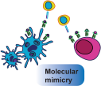

# MIMICRY: A database of Microbial Immunogenic Mimicry in Cancer 
The human microbiome is a complex ecosystem of microorganisms inhabiting various body niches, and plays a crucial role in health and disease. Recent studies suggest a connection between the microbiome and cancer, particularly through immune modulation. Specifically, T-cells have found to cross-react between microbial and cancer epitopes. We hypothesised that shared epitopes could unveil new pathways for immune evasion by tumors or present novel therapeutic targets. 

## Instructions for a local version of the app
1. Open a terminal (or VS Code terminal).
2. Run:
`git clone https://github.com/UNSW-Bioinformatics/cancervacc/repo.git`
or download the github through the link. 
3. Within a terminal, navigate to the cancervacc repo 
4. Install required libraries
`pip3 install -r requirements.txt`  
5.  Run app!
`python3 app.py`
6. This should provide a local URL (e.g.,128.2.4.1:8000) which you can open in your browser
